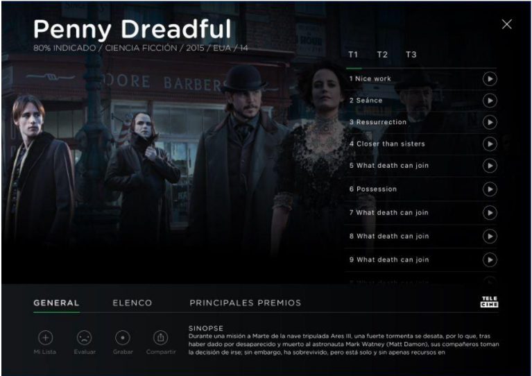
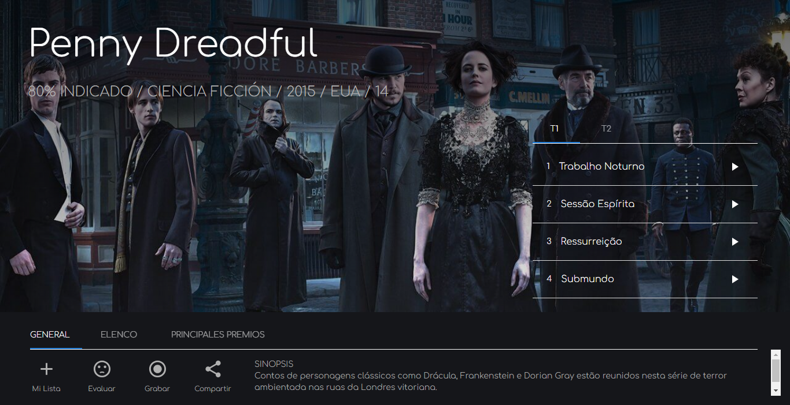
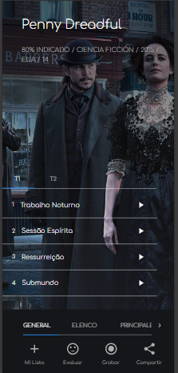
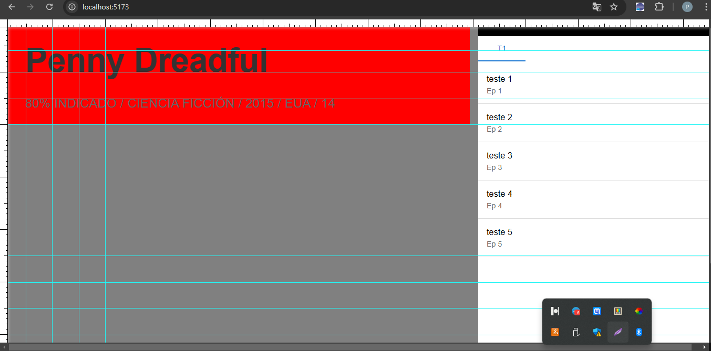

# 🚀 AgileTV test

- Interface de usuário criada para processo seletivo da **AgileTV**, feita com **React + Vite**, **MUI**, **Axios** e **Sass (pré-processador CSS)**.
- Este é um projeto **ReactJS** criado com `npm create vite@latest`.
- Para executá-lo, é necessário ter **Node.js 18+ ou 20+**. Consulte Doc Vite.dev.

---

## 🚀 Tecnologias Utilizadas

- **React + Vite**
- **MUI (Material-UI)**
- **Axios**
- **Sass (pré-processador CSS)**

---

## 💻 Como executar o projeto

### 1️⃣ Clone o repositório

- `git clone https://github.com/Pedro-costa99/my-app-agiletv.git`
- `cd my-app-agiletv`
- `code .`

### 2️⃣ Instale as dependências

- `npm install`

### 3️⃣ Inicie o servidor de desenvolvimento

- `npm run dev`
- Acesse `http://localhost:3000` no navegador para ver o resultado.

---

## ✅ Funcionalidades

- Interface dinâmica e responsiva para exibição de episódios de uma série.
- Navegação fluida entre temporadas e episódios.
- Carregamento otimizado de imagens e dados.
- Design moderno com **Material-UI** para melhor experiência do usuário.

---

## Licença 📜

- Este projeto foi desenvolvido exclusivamente para o processo seletivo da **AgileTV** e não possui uma licença pública.

---

# 📺 Interface AgileTV

## 🖥️ UI Implementada - PC

## 📱 UI Implementada - Mobile

### 🎨 Para criar UIs profissionais, é essencial aplicar conceitos de design gráfico e estratégias adequadas desde a concepção para garantir eficiência e qualidade.

- **UI - Esboço 01**
  

- **UI - Esboço 02**  
  
